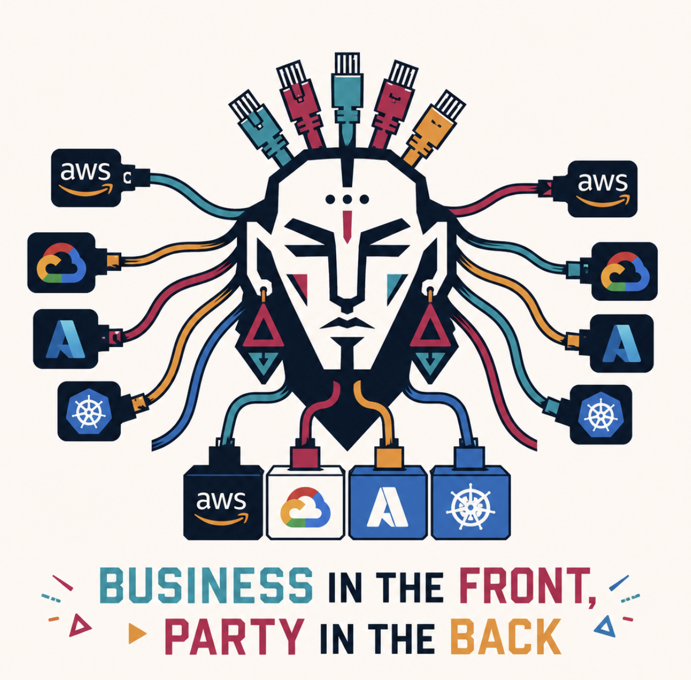

<p align="center"></p>

# shimanism

[](LICENSE)
[](#code-architecture-and-how-the-build-works)
[](docs/codegen.md)
[](docs/testing.md)
[](#code-architecture-and-how-the-build-works)

<!-- per-major-component (numbers auto-updated by scripts/update-readme-badges.sh) -->


**Reroute cloud services, one at a time.**

shimanism is a translation proxy that speaks the cloud's own published API on the front and forwards each call to a real, comparable service somewhere else — another cloud, a Kubernetes operator, or a self-hosted server.

Keep your existing AWS code talking to "AWS"; transparently reroute, say, storage to GCS while everything else still uses real AWS; verify it works; reroute the next service; repeat. The shim is a stable on-ramp between clouds — no big-bang rewrite, no SDK swap, no Terraform-provider port.

Your code keeps using `boto3`, `aws s3`, `gcloud storage`, `hashicorp/aws`, the Azure SDK, or whatever else. You change one thing: the endpoint URL. The bytes land wherever the shim is pointed.

Nothing is reimplemented. Nothing is emulated. The data lives in a real backend.

## See it in action

The same MinIO server, accessed three different ways via three different shim frontends:

**AWS CLI:**

```sh
aws --endpoint-url=http://localhost:9001 s3 mb s3://my-bucket
aws --endpoint-url=http://localhost:9001 s3 cp app.tar.gz s3://my-bucket/
aws --endpoint-url=http://localhost:9001 s3 ls s3://my-bucket/
```

**gcloud CLI:**

```sh
gcloud storage buckets create gs://my-bucket \
  --api-endpoint-overrides=storage=http://localhost:9002
gcloud storage cp app.tar.gz gs://my-bucket/ \
  --api-endpoint-overrides=storage=http://localhost:9002
```

**Go SDK (AWS S3):**

```go
client := s3.NewFromConfig(aws.Config{
    Region:       "us-east-1",
    BaseEndpoint: aws.String("http://localhost:9001"),
})
_, err := client.PutObject(ctx, &s3.PutObjectInput{
    Bucket: aws.String("my-bucket"),
    Key:    aws.String("app.tar.gz"),
    Body:   strings.NewReader("..."),
})
```

**Terraform (`hashicorp/aws`):**

```hcl
provider "aws" {
  region                      = "us-east-1"
  access_key                  = "test"
  secret_key                  = "test"
  skip_credentials_validation = true
  skip_metadata_api_check     = true
  skip_requesting_account_id  = true
  s3_use_path_style           = true

  endpoints {
    s3 = "http://localhost:9001"
  }
}

resource "aws_s3_bucket" "app" {
  bucket = "my-bucket"
}
```

All four examples produce a real bucket holding real bytes — in MinIO (or GCS, Azure Blob, real S3, etc., whichever backend the shim was started with). The clients don't know they're not talking to real S3 / real GCS.

See [docs/getting-started.md](docs/getting-started.md) for the five-minute walkthrough and [docs/end-to-end-examples.md](docs/end-to-end-examples.md) for real backend, optional simulator, SDK, CLI, and Terraform import examples.

## Shimmed services

| Service | AWS | GCP | Azure | Kubernetes | Per-service docs |
|---|---|---|---|---|---|
| Object storage | S3 | Cloud Storage | Blob Storage | MinIO | [docs/services/storage.md](docs/services/storage.md) |
| Secrets | Secrets Manager | Secret Manager | Key Vault | Vault | [docs/services/secrets.md](docs/services/secrets.md) |
| Queue | SQS | Pub/Sub (pull) | Service Bus queue | NATS JetStream | [docs/services/queue.md](docs/services/queue.md) |
| Pub/sub | SNS + SQS | Pub/Sub | Service Bus topics | NATS | [docs/services/pubsub.md](docs/services/pubsub.md) |
| Managed Postgres / MySQL *(control plane)* | RDS | Cloud SQL | Azure DB Flexible Server | CloudNativePG / MySQL Operator | [docs/services/rdbms.md](docs/services/rdbms.md) |
| Managed Redis *(control plane)* | ElastiCache | Memorystore | Azure Cache for Redis | Redis Operator | [docs/services/cache.md](docs/services/cache.md) |
| Functions *(container image, control plane)* | Lambda | Cloud Run | Container Apps | Knative | [docs/services/functions.md](docs/services/functions.md) |
| API gateway | API Gateway HTTP API v2 | API Gateway | API Management | Envoy Gateway | [docs/services/apigateway.md](docs/services/apigateway.md) |

Managed databases and managed Redis: only the **control plane** is shimmed (provisioning, scaling, snapshots, access bindings). The data plane is wire-protocol Postgres / MySQL / RESP — connect directly to the returned host.

## Why this works

Every shim is two layers:

- **Frontend:** speaks the cloud's published API exactly (SigV4 + S3 XML; OAuth2 + GCP JSON; SharedKey + Azure REST; etc). The codegen pipeline (currently Smithy-only; see [docs/codegen.md](docs/codegen.md)) produces server stubs from the upstream spec for storage; the other services compose the wire layer by hand using the cloud SDKs' wire-type packages directly. Migrating the rest to codegen is on the roadmap.
- **Backend:** calls the real destination. AWS frontend over a GCS backend = AWS S3 wire on the front, real `storage.googleapis.com` on the back.

In between sits a neutral **domain** interface — the cross-cloud intersection of what every backend actually supports. Where a feature has no peer (S3 Object Lambda, Azure private endpoints, GCP-only retention), the shim returns the source cloud's own "not supported" error in its own vocabulary. **Never a fabricated success. Never a silent fallback.** See [PHILOSOPHY.md](PHILOSOPHY.md) for the *why*.

## Goals

- Shim cloud-locked managed services that publish strong, machine-readable APIs (OpenAPI, protobuf, ARM schema, Smithy).
- Translate honestly between AWS, GCP, Azure, and a selected Kubernetes-native peer per service.
- Stay transparent to existing SDKs, CLIs, and Terraform providers via their built-in endpoint-override.
- Cover the **intersection** of functionality across all backends. Where a feature has no peer, fail loud in the source cloud's own error vocabulary.
- Build the Kubernetes peer ourselves if no suitable open-source equivalent exists.

## How shimanism differs from other projects

shimanism's niche: it lives at the **wire-protocol layer**, speaks the source cloud's exact API, and runs against **real backends** — not emulators, not its own API, not a single-cloud compatibility shim. The result is that the same `aws`, `gcloud`, `boto3`, Terraform module, or Pulumi provider works without modification while data moves between clouds.

The closest comparison points and how shimanism differs from each:

| Project | What it is | How shimanism differs |
|---|---|---|
| **[LocalStack](https://localstack.cloud/)** | Local cloud emulator (AWS-shape; Pro adds Snowflake + others) for dev/test; state in-process or persisted to disk via the persistence module. | shimanism is not an emulator. Data lives in real backends. Production migration is the use case; LocalStack is dev/test. The LocalStack-backed shimanism path is not tested yet. |
| **[MinIO](https://min.io/)**, Cloudflare R2, Backblaze B2 | S3-compatible *backends*. They implement the S3 wire on top of their own storage. | shimanism is a *frontend translation layer*, not a backend. It can use MinIO as a backend; the value-add is the cross-cloud frontend matrix (`gcloud` → GCS frontend → MinIO; `aws` → S3 frontend → MinIO; etc.) and the other shimmed services beyond storage. |
| **[Crossplane](https://www.crossplane.io/)** | Kubernetes CR-based control plane for multi-cloud infrastructure. Provider CRDs (managed resources) + composed `XR` abstractions via `XRD` + `Composition`. | **Crossplane requires you to stop using your cloud SDK / IaC provider and rewrite to its CRD model.** shimanism lets you keep the *original* SDK (`aws-sdk-go`, `boto3`, `@aws-sdk/*`, `cloud.google.com/go/...`, Azure SDK) and the *original* IaC (`hashicorp/aws`, `hashicorp/google`, `hashicorp/azurerm`) — same calls, same plans, just pointed at a different endpoint. No new abstraction to learn, no per-resource CRD translation. |
| **[Dapr](https://dapr.io/)** | Distributed-app runtime with multi-cloud bindings for state, pub/sub, secrets, etc. Apps call the Dapr SDK/sidecar. | Dapr requires you to rewrite to its API. shimanism lets you keep the cloud's API. Different target: Dapr is for greenfield apps that want portability; shimanism is for brownfield apps that need migration. |
| **[gocloud.dev](https://gocloud.dev/)** / **[Apache Libcloud](https://libcloud.apache.org/)** / **[Apache jclouds](https://jclouds.apache.org/)** | Neutral cloud-agnostic SDKs (Go / Python / JVM). Apps import the neutral library instead of the cloud SDK. | Library-level abstraction — apps swap SDKs. shimanism keeps the cloud SDK; no library swap, any language. |
| **[Pulumi](https://www.pulumi.com/)** / **[Terraform](https://www.terraform.io/)** / **[OpenTofu](https://opentofu.org/)** / **AWS CDK** | Infrastructure-as-code with multi-cloud provider plugins. | IaC tools, not data-plane proxies. They provision resources; they don't proxy runtime API calls. shimanism works *with* them — your Terraform / OpenTofu plan still uses `hashicorp/aws`, but the bytes land on GCS through the shim. |
| **OpenStack Swift S3 middleware**, **Ceph RGW**, **[Garage](https://garagehq.deuxfleurs.fr/)**, **[NooBaa](https://www.noobaa.io/)**, **[s3proxy](https://github.com/gaul/s3proxy)** | S3-compatible APIs on top of various storage backends. | Single-frontend (S3), single-service (object storage) compat shims. shimanism spans multiple frontend shapes × multiple backends × multiple service families. |

The mental model: shimanism is to **rerouting cloud services one at a time** what cross-compilation is to portable binaries. The application doesn't know the target changed; the platform layer below it absorbed the difference, honestly.

For deeper reading: [PHILOSOPHY.md](PHILOSOPHY.md) on the "intersection-only, never lie" stance; [docs/architecture.md](docs/architecture.md) on the frontend/domain/backend layering; [docs/cross-cloud-routing.md](docs/cross-cloud-routing.md) on the migration story end-to-end.

## Non-goals

- **Not an emulator.** shimanism does not reimplement services in-memory or on local disk. For local testing, shimanism has a maintained sockerless simulator lane; LocalStack may also be useful for AWS-shaped local development, but that path is not tested by this project yet.
- **Not a neutral SDK.** There is no shimanism client library. Application code keeps importing `boto3`, `@azure/storage-blob`, `google-cloud-pubsub`, and so on.
- **Not a lowest-common-denominator abstraction layer.** We honor the source cloud's API. Where a call cannot be translated honestly, it fails in the source cloud's own error vocabulary rather than being smoothed over.
- **Not a Terraform wrapper.** Control-plane operations call the cloud admin APIs directly.
- **Not for services where redirection is already trivial.** Postgres, MySQL, and Redis speak the same wire protocol everywhere; their data planes are not shimmed.
- **Not for services with fundamentally incompatible models across clouds**, such as IAM and identity.
- **Not for layers already standardized by the industry**: Kubernetes, OCI distribution, OpenTelemetry.

## Maturity

shimanism is pre-1.0 and pre-production. The honest state per surface:

| Surface | Status |
|---|---|
| Service catalog | The 8 services in the table above are wired end-to-end against inmem / local emulator backends. |
| `inmem` backend per service | Works. Used for local dev + the conformance harness. |
| Local emulator backends (MinIO / NATS / Vault / kind + Knative / kind + Envoy Gateway / cnpg / Redis Operator) | Work; exercised by per-backend conformance lanes in CI. |
| Cross-cloud terraform import (Phase 9) | Works; `TestCrossCloudImport_Roundtrip_*` per service. |
| Cross-cloud terraform apply (Phase 10) | Storage exit criterion green (`TestCrossCloudApply_Roundtrip_StorageAWStoGCS`); other services have documented-skip cross-cloud cells with per-cell asymmetry rationale (real cloud-API mismatches, not shim bugs). |
| Real-cloud backends (passthrough to actual AWS / GCP / Azure accounts) | Gated on "Track A" — cloud test accounts. Not yet exercised in CI. |
| Request signature verification (SigV4 / OAuth2 / SharedKey) | **Not implemented yet** — see [BUG-18](BUGS.md). The shim accepts unsigned requests today. Do not expose to untrusted traffic until BUG-18 closes. |
| Codegen pipeline | Smithy-only (`cmd/codegen`); only storage has generated stubs today. Other services compose their wire layer by hand using the cloud SDKs' wire-type packages. See [docs/codegen.md](docs/codegen.md). |

The full bug ledger lives in [BUGS.md](BUGS.md).

## Code architecture and how the build works

If you just cloned the repo, here is the orientation in 60 seconds.

**Layout.** One Go module, three structural buckets:

- `cmd/` — entry points. `cmd/shim` is the actual server you run. `cmd/codegen`, `cmd/azure-codegen`, `cmd/gcp-codegen` are spec→code generators that produce the files under `services/<svc>/gen/`. `cmd/inject-provenance` stamps every vendored spec with a `_provenance` key so CI can detect spec drift.
- `internal/<svc>/` — the **frontend** (wire decode/encode + per-cloud quirks) and the **domain** interface for each shimmed service. The frontends call the domain; the domain has no knowledge of any backend.
- `services/<svc>/` — the **spec** vendored from upstream (`spec/`), the **generated** server stubs and types (`gen/`), the **backends** that translate domain calls into the destination cloud's SDK (`backends/aws`, `backends/gcs`, `backends/azureblob`, `backends/inmem`, plus the K8s peer where applicable), and the **conformance** tests that drive every (frontend × driver × backend) cell.

The K8s peer framework lives at `peers/shimakit/` (its own Go module). Cross-shim machinery — auth verifiers, AWS protocol routers (`awsjson`, `awsquery`, `restxml`), client-config helpers — lives under `internal/`.

**Minimal common footprint.** Every shimmed service reduces to one tiny Go interface — the cross-cloud intersection of what AWS, GCP, Azure, and the K8s peer all support. The whole catalog adds up to **75 methods total** across 8 services:

| Service | Domain interface | Methods |
|---|---|---|
| storage | `domain.Storage` | 16 |
| queue | `domain.Queues` | 12 |
| pubsub | `domain.Pubsub` | 12 |
| rdbms | `domain.RDBMS` | 11 |
| secrets | `domain.Secrets` | 8 |
| cache | `domain.Cache` | 6 |
| functions | `domain.Functions` | 5 |
| apigateway | `domain.APIGateway` | 5 |

Frontends collectively implement *hundreds* of cloud-specific wire operations (`ListObjectsV2`, `GetBucketLifecycleConfiguration`, …); backends implement at most these handfuls. That asymmetry is the whole point — the per-cloud surface area is huge, the cross-cloud intersection is small, and everything that doesn't fit the intersection fails loud in the source cloud's own error vocabulary.

**Spec → code (the unusual bit).** shimanism does not hand-write the wire layer for each cloud. Three codegen lanes, all wired through `make codegen`, walk vendored specs and emit Go:

- **AWS Smithy → custom emitter** (`cmd/codegen`). Smithy has no official server-side Go generator, so the emitter is in-house; it handles all four AWS protocols (REST-XML, awsJson1.0/1.1, awsQuery, restJson1). Generated stubs land in `services/<svc>/gen/`.
- **Azure OpenAPI v2 → 8-stage preprocessor + `oapi-codegen`** (`cmd/azure-codegen`). The preprocessor flattens ARM idioms (`x-ms-paths`, `x-ms-enum`, external `$ref`, `allOf`) into something `oapi-codegen` can consume.
- **GCP Discovery → routing-only emitter** (`cmd/gcp-codegen`). Wire types are *reused* from `google.golang.org/api/<svc>/v1` — Discovery → Go structs is already solved upstream. Our emitter only produces the dispatch layer.

What's hand-written is the per-backend `translate.go` files (one per operation) that map the generated request shapes into the destination cloud's SDK call, and a per-frontend `adapter.go` that glues the generated server stubs to the domain interface. That keeps the spec the source of truth: when upstream changes the spec, `make codegen` produces a diff and only the translation table needs human eyes. `make codegen-check` (also run by CI) enforces that committed gen output matches what the spec produces today.

Start at [docs/architecture.md](docs/architecture.md) for the layer diagram and the full code-layout map, then [docs/codegen.md](docs/codegen.md) for the spec-to-running-handler walkthrough.

## Documentation

The repo root keeps a small set of load-bearing files. Everything else lives under [`docs/`](docs/).

- **[docs/](docs/README.md)** — the documentation index. Start here for setup, architecture, contributing, testing, codegen, releasing, and per-service detail.
- **[docs/end-to-end-examples.md](docs/end-to-end-examples.md)** — start from real cloud credentials or an optional local simulator, then drive the shim with CLI, SDK, and Terraform provider endpoints.
- **[PHILOSOPHY.md](PHILOSOPHY.md)** — the *why* every contributor should read before changing code.
- **[AGENTS.md](AGENTS.md)** — rules for human and LLM contributors. The continuity contract, the no-fakes rule, the bug-first rule, branch + PR hygiene.
- **[PLAN.md](PLAN.md)** — phase roadmap and exit criteria.
- **[STATUS.md](STATUS.md)** · **[DO_NEXT.md](DO_NEXT.md)** · **[WHAT_WE_DID.md](WHAT_WE_DID.md)** · **[BUGS.md](BUGS.md)** — the four continuity files that carry the project across sessions.

## License

AGPL-3.0.
